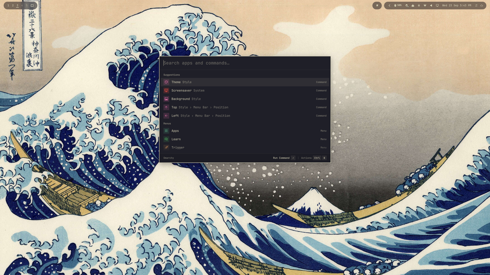

# Super Menu

A Raycast-style replacement for Omarchy's built-in menu (`omarchy.menu`) that
can answer what you type, not just search for it.



Everything the stock menu does still works: the JSONC menu tree, installed
apps, scored search, `provider` submenus, `when:`/`checked:` guards, and the
dmenu mode other Omarchy scripts rely on. On top of that it adds a fixed
launcher window, Favorites and Suggestions, an action panel, an app detail
pane, and **query plugins**: small extensions that turn the typed text into a
result row pinned above the search results.

```
2^10 + 5*3        ->  3072
100 usd to eur    ->  €86.45
100 km to miles   ->  62.137119 mi
```

Enter copies the result. The clipboard gets full precision even though the row
shows a rounded value.

## Install

```bash
omarchy plugin add https://github.com/IRostom/super-menu.git --enable
```

Super Menu declares `omarchy.clonedFrom: "omarchy.menu"`. Enabling it
switches the built-in menu off and puts Super Menu's button where the
built-in one was in the bar. The shell also sends every call aimed at the
built-in menu to the enabled replacement (`PluginRegistry.resolveEnabledId()`),
so **SUPER+Space needs no Hyprland change**: `omarchy-menu toggle` and every
dmenu caller reach Super Menu once it is enabled.

To update later:

```bash
omarchy plugin update io.github.irostom.super-menu
```

### Requirements

- Omarchy Quattro (4.x) with the Quickshell-based Omarchy shell.
- `qalc` (libqalculate) for the built-in calculator and converter.
- `wl-copy` (wl-clipboard) for copying results.

Both ship with Omarchy. Without `qalc` the calculator stays silent, and
everything else keeps working.

## Remove

```bash
omarchy plugin remove io.github.irostom.super-menu
```

Removing it disables Super Menu first, which switches the built-in
`omarchy.menu` back on and returns it to its place in the bar. To keep Super
Menu installed but go back to the stock menu, use
`omarchy plugin disable io.github.irostom.super-menu` instead.

Super Menu writes only to these paths, all outside `~/.config`. Delete them
too for a clean removal:

- `$XDG_STATE_HOME/omarchy/menu-history.json`: your Favorites and recent
  launches.
- `$XDG_STATE_HOME/omarchy/menu-qalc/`: the calculator's private `qalc`
  config.

Query plugins you wrote in `~/.config/omarchy/menu-plugins/` are yours and are
left alone.

## The launcher window

The menu opens as a fixed 770 × 480 window (scaled with the shell's font
size), its top a third of the way down the screen, so typing never moves or
resizes it. Corners follow the system `corner-radius`. dmenu pickers keep the
width their caller asks for and grow downward from the same top line.

The search field is a real text input: it has a cursor, selection, paste and
IME. Keys that drive the list are taken before the input sees them:

| Key | Does |
|---|---|
| ↑ ↓, PgUp PgDn | Move the selection |
| Enter | Run the selected row |
| → | Same as Enter, once the text cursor is at the end of the query |
| Esc | Clear the query; with no query, close |
| Backspace, ← | With no query, go back to the parent menu |
| Ctrl+U | Clear the query |
| Delete | With the text cursor at the end, uninstall the selected app |
| Ctrl+B, Ctrl+K | Open or close the action panel |
| Ctrl+Shift+F | Add the selected row to Favorites, or remove it |
| Ctrl+Shift+C | Copy the app's desktop ID, the command, or the answer |
| Ctrl (hold) | Show Ctrl+1…9, Ctrl+0 on the first ten rows |
| Ctrl+1…9, Ctrl+0 | Run that row directly |
| Ctrl+D | On an app, show or hide the detail pane |

### Footer and actions

The footer shows where you are on the left, and on the right what Enter will
do for the selected row ("Open Application", "Run Command", "Open Menu",
"Copy Answer"), then "Actions Ctrl B" when the row has more than one.

Ctrl+B opens the action panel above the footer, listing every action for the
row with its shortcut. It has its own filter field: type to narrow the list,
Enter to run, Esc or Ctrl+B to close. The actions are defined in
`Actions.js`:

| Row | Actions |
|---|---|
| App | Open, Add to Favorites, Show Details, Copy Desktop ID, Uninstall… |
| Command | Run, Add to Favorites, Copy Command |
| Menu | Open, Add to Favorites |
| Answer | Copy (or Run, if the plugin gives an action) |
| Any row in Suggestions | also Remove from Suggestions |

### Quick access and details

Hold Ctrl on its own for a moment and the first ten rows swap their type label
for the shortcut that runs them, Ctrl+1 through Ctrl+0. The shortcuts work
without waiting for the keycaps too.

Ctrl+D on an app opens a detail pane beside the list: the app's icon, name
and description, then its command, categories, keywords and desktop ID from
the desktop entry. It follows the selection and stays on until Ctrl+D again;
non-app rows get the full width back.

### Progress

The rule under the search field doubles as a progress bar. While a menu
provider or a `command` query plugin is running, a short accent segment
sweeps across it. It waits 250ms before showing, so fast answers never
flicker it.

### Rows and sections

Rows follow vicinae's layout: an icon, the title with its subtitle (the
parent path, or the item's description) inline, and a type label on the
right: Application, Command or Menu. Glyph icons sit on a tile tinted with
their top-level menu's color, taken from the theme's `colors.toml` (`blue`,
`yellow`, `orange`, ...), so the tiles change with `omarchy theme set`.

The root, with nothing typed, shows **Favorites** (pinned rows), then
**Suggestions** (the five most recent launches not already pinned), then the
top-level **Menus**. Launching an app or command records it. Both lists live
in `$XDG_STATE_HOME/omarchy/menu-history.json`, as item ids:

```json
{ "favorites": ["style.background"], "recents": [{ "id": "apps.Alacritty", "at": 1790000000000 }] }
```

A search groups its rows under **Results**, with **Menus** or **In submenus**
split out when both kinds match, and query-plugin answers under the plugin's
title (Calculator).

Hovering a row highlights it but does not select it; Enter always acts on the
keyboard selection. Click to run a row.

## Writing a query plugin

Drop a `.js` file in `~/.config/omarchy/menu-plugins/`. It is read at startup
and on `omarchy menu refresh`. See `examples/` for working copies.

```js
// ~/.config/omarchy/menu-plugins/uuid.js
descriptor = {
  id: "uuid",
  title: "Generate UUID",
  icon: "󰄿",
  kind: "js",                       // runs in the shell's JS engine, no fork
  trigger: { keywords: ["uuid"] },  // "uuid" or "uuid 5"
  rows: function (match) {
    return [{ value: crypto.randomUUID(), detail: "UUID v4" }]
  }
}
```

A plugin that needs the network, a secret, or a real runtime uses `kind:
"command"` instead — any executable, in any language:

```js
descriptor = {
  id: "weather",
  title: "Weather",
  kind: "command",
  trigger: { keywords: ["weather", "wx"] },
  argv: ["/home/you/.config/omarchy/menu-plugins/weather.sh"],
  queryVia: "env",     // arrives as $OMARCHY_QUERY
  timeout: 2000
}
```

The command prints one JSON object (or an array) on its last non-empty line,
and exits 0. Printing nothing means "no answer" and is not an error.

### Descriptor fields

| Field | Default | Meaning |
|---|---|---|
| `id` | — | Required. A user plugin reusing a built-in id **replaces** it. |
| `title` | `id` | Row subtitle when a result gives no `detail`. |
| `icon` / `iconFont` | `""` | Nerd Font glyph for the icon column. |
| `priority` | `50` | Higher sorts first. An explicit trigger adds 1000. |
| `kind` | `"command"` | `"js"` (in-engine, synchronous) or `"command"`. |
| `trigger` | — | See below. |
| `maxRows` | `1` | Cap on rows this plugin may contribute. |
| `debounce` | `140` | ms of quiet before a `command` runs. Ignored for `js`. |
| `timeout` | `1500` | ms before the process is SIGKILLed. |
| `stealsFocus` | `"explicit"` | `true`, `false`, or `"explicit"` — see below. |
| `argv` | `[]` | `command` only. `{{query}}` is replaced as one whole element. |
| `queryVia` | `"env"` | `"env"` (`$OMARCHY_QUERY`), `"argv"`, or `"stdin"`. |
| `acceptExitCodes` | `[0]` | Any other exit code yields no rows. |

### Triggers

Triggers are checked in this order, and the first that fits wins:

- `prefixes: ["="]` — the prefix is **stripped** from the text the plugin
  receives, and the match counts as explicit.
- `keywords: ["uuid"]` — matches the first word; the rest is the text. Also
  explicit.
- `minLength` (default 2), then `match(query)` (a function returning
  `false` / `true` / `{text, explicit}`), then `gate(query)` (a predicate),
  then `regex` + `regexFlags` (strings, not literals).

A gate should be cheap and strict. `command` plugins fork a process, and a
loose trigger costs one on every keystroke.

### Result rows

```js
{
  value:  "€86.45",          // the big line; required
  detail: "= 100 usd to eur",// small line under it
  copy:   "€86.45283998",    // what Enter copies; defaults to value
  action: "",                // shell string to run instead of copying
  actionArgv: [],            // preferred: argv, run without a shell
  icon:   "",                // defaults to the descriptor's icon
  question: "100 usd to eur",// optional: render as a question -> answer card
  questionLabel: "",         // caption under the question (default "Expression")
  answerLabel: ""            // caption under the answer (default "Result")
}
```

With a `question`, the row is drawn as vicinae's two-column calculator card:
the question on the left with its operators dimmed, the answer on the right,
an arrow between. Without one it is a single row with the value large. The
built-in calculator sends its query as the question.

Enter runs `actionArgv` if set, else `action`, else copies `copy`. A copy
shows "Copied …" in the footer for a moment before the launcher closes (Esc
closes it at once).

### Focus

An answer that arrives while you are still typing must not steal the Enter key
from the search result you were aiming at. That is what `stealsFocus` governs,
and the default `"explicit"` means the answer takes the cursor only when it was
explicitly asked for — `=2+2` puts Enter on the answer, plain `2+2` leaves it on
the first search result. Moving the cursor yourself always wins: the selected
row is restored by identity across a rebuild, so a late answer cannot move it.

### Failure handling

A plugin that throws, times out, or returns an unusable exit code three times in
a row is disabled for the rest of the shell session, with a warning in the log.
A `kind: "js"` plugin runs on the UI thread — an infinite loop there freezes the
menu, so put anything slow in a `command` plugin.

## The built-in calculator

`query-plugins/calc.sh` wraps `qalc`, covering arithmetic, unit conversion and
currency in one call. Two details worth knowing:

**The gate is not optional.** `qalc` answers almost anything, including ordinary
menu words, and with a successful exit status:

```
qalc -t theme  ->  30.93650008 kg·m³/ms²   (exit 0)
qalc -t font   ->  1E−24 B·t               (exit 0)
```

So exit status can never separate a real answer from noise. `QueryPlugins.js`
gates on an allowlist instead: a query is only forwarded if every alphabetic
token in it is a known unit or currency. Anything else needs the `=` prefix.

**It never touches your qalc config.** `qalc` rewrites its config on exit
(`save_mode_on_exit=1`), so the script points `XDG_CONFIG_HOME` at a private
directory under `~/.local/state/omarchy/menu-qalc`. Exchange rates still come
from the shared cache under `XDG_DATA_HOME`, so nothing is duplicated.

Rates are **never** refreshed from the keystroke path — `-s "upxrates 0"`
guarantees it, because the qalc default is "ask", which can block on the
network. To refresh them by hand:

```bash
qalc -e -t 1
```

## Files

| File | Role |
|---|---|
| `Menu.qml` | Menu logic, cloned from `omarchy.menu`: IPC, menu tree, providers, dmenu, query plugins, layout sizing. Query-plugin hooks are marked in the source. |
| `launcher/` | The menu's view: `Appearance.qml` (visual tokens, window size), `LauncherState.qml` (state the views read), `SearchBar.qml`, `ListRow.qml` + `IconTile.qml`, `SectionHeader.qml`, `Footer.qml` + `FooterButton.qml`, `ActionPanel.qml`, `Keycaps.qml`, `AnswerCard.qml` + `Badge.qml`, `LoadingBar.qml`, `DetailPane.qml`, scroll fades and empty state. `Menu.qml` aliases the tokens and state under their old names. |
| `MenuModel.js` | Cloned model helpers, plus the `copyText`/`actionArgv` roles. |
| `QueryPlugins.js` | Registry, trigger gate, row normalization, JS compilation. |
| `QueryBuiltins.js` | Descriptors for the shipped plugins. |
| `Actions.js` | What each kind of row can do, their shortcuts and keycaps. |
| `Sections.js` | Section labels for the list: root, search, answers. |
| `MenuHistory.qml` | Favorites and recent launches, stored in `$XDG_STATE_HOME/omarchy/menu-history.json`. |
| `query-plugins/calc.sh` | The calculator/converter. |
| `AppLibrary.qml`, `AppSearch.js` | Verbatim copies of the shell's own — see below. |
| `examples/` | Sample query plugins. Not loaded; copy them to use them. |
| `upstream/` | Pristine originals for 3-way merges on Omarchy updates. Reference only; nothing loads them. The original manifest is kept as `manifest.json.orig`, so the repository holds exactly one plugin manifest. |

### Why the app library is vendored

The shell hands a scoped `appLibrary` to any plugin declaring `kind: "menu"`,
but it does not survive for a *cloned* menu. `shell.qml`'s `prunePluginApis()`
destroys a third-party plugin's scoped APIs whenever `isEnabled()` reads false,
which it transiently does while `shell.json` is being re-applied — and nothing
ever re-injects them. `isEnabled()` short-circuits to `true` for first-party
plugins, so only clones are affected: the built-in menu's Apps list works while
an identical clone's is empty.

So this plugin owns its app library instead of borrowing one. `AppLibrary.qml` and `AppSearch.js` are unmodified
copies; they reach everything they need through `$OMARCHY_PATH` and the
`omarchy-shell` CLI, so they run fine outside the shell tree.

## Diagnostics

```bash
omarchy-shell shell call io.github.irostom.super-menu selftest '{"query":"100 usd to eur"}'
```

Reports which plugins loaded, whether the engine allows runtime JS compilation,
how many apps are visible, and which plugins match a given query — without
opening the menu.

## Keeping up with upstream

`upstream/` holds the files as they shipped, with the Omarchy version they came
from. When Omarchy updates the menu:

```bash
U=/usr/share/omarchy/shell/plugins/menu
diff3 -m Menu.qml upstream/Menu.qml $U/Menu.qml > Menu.qml.merged
```

Review, replace, then refresh `upstream/` and bump `version` in `manifest.json`.
Copy the new upstream manifest in as `upstream/manifest.json.orig`, never as
`manifest.json`: the marketplace rejects a repository with a second plugin
manifest.

## License

MIT. See [LICENSE](LICENSE). Super Menu is derived from Omarchy's built-in
menu, which is MIT-licensed by David Heinemeier Hansson. Its notice is included
in the same file.
